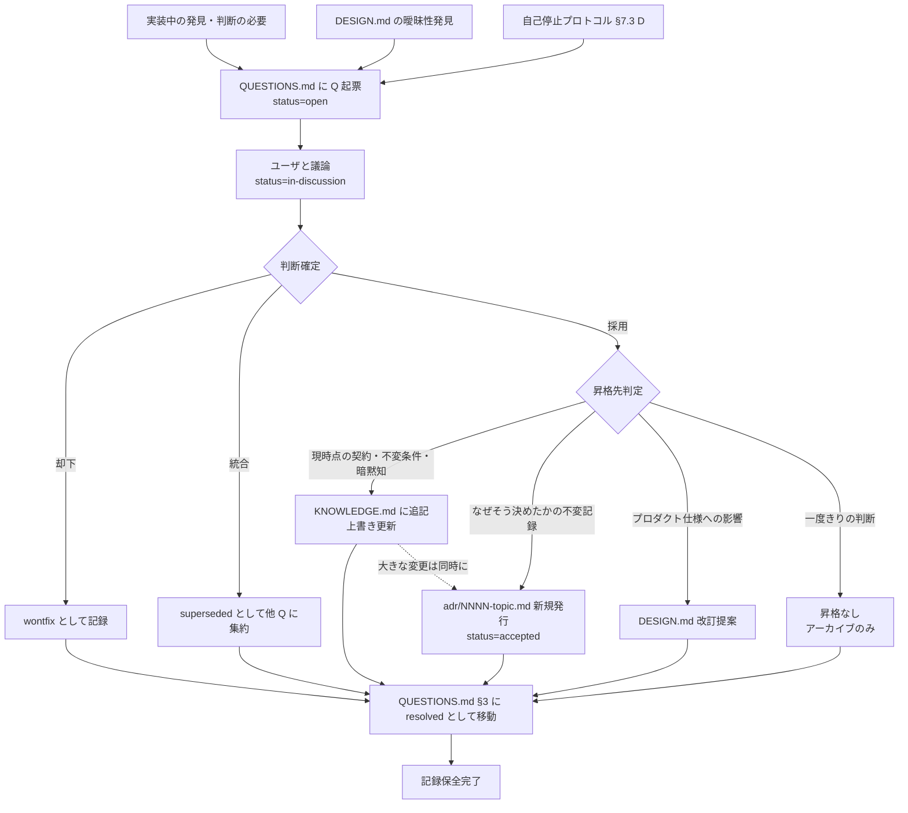

# CLAUDE.md — LLM 作業ガイド

**このプロジェクトは Clojure + Polylith ワークスペースです**。
必須技術は **Clojure 1.12 + tools.deps + Polylith + Malli + clj-kondo + cljfmt**（JVM 21 LTS）。
目的別の追加ライブラリ（HTTP、DB、ライフサイクル管理等）は **stack** として構成され、詳細は `project-guide/STACK_GUIDE.md` を参照。
本ファイルは、本リポジトリで作業する LLM エージェント（Claude Code を主想定）への指示書である。
人間向けの説明ではない。**LLM はこのファイルを毎セッション必ず最初に読み、ここに書かれた規約から外れない**。

## 本文書群の参照関係

### ルート直下（最重要）

| 文書 | 役割 | いつ読むか |
|---|---|---|
| **CLAUDE.md（本文書）** | 第一原理と常時制約 | **毎セッション必読** |
| **DESIGN.md** | プロダクト仕様（何を作るか） | 実装に着手する前、仕様を確認する時 |
| **AGENTS.md** | 非 Claude エージェント（Codex、GitHub Copilot 等が読む標準慣習、OpenAI 提唱）向けリダイレクタ。内容は「CLAUDE.md に従え」の 1 行のみ | 他エージェント実行時 |

### project-guide/（プロジェクト運営ガイド）

| 文書 | 役割 | いつ読むか |
|---|---|---|
| `project-guide/CODING_GUIDE.md` | Clojure の書き方詳細、LLM 特有の落とし穴 | コーディング判断に迷った時 |
| `project-guide/POLYLITH_GUIDE.md` | Polylith 構造の詳細運用、brick 追加手順、境界判断 | brick 追加時・`poly check` で詰まった時 |
| `project-guide/STACK_GUIDE.md` | 技術スタック選定の論理と実装（必須層 / stack 層 / 横断層） | stack 選択時、新ライブラリ採用検討時、技術選定根拠の確認時 |
| `project-guide/COLLABORATION_GUIDE.md` | LLM と人間の協働プロトコル（役割分担・曖昧性解消・対話） | 協働方針・質問粒度・役割優先順位で迷った時 |
| `project-guide/BOOTSTRAP_GUIDE.md` | プロジェクト初期化手順 | **初期化期のみ**。完了後は `project-guide/archived/` に移動 |
| `project-guide/MAINTAINERS_GUIDE.md` | テンプレート自体の設計原則・保守者向け | テンプレート改修・ライブラリ更新・規約追加時 |

### project-memory/（プロジェクトの記憶）

原則 13（仕様・知識・決定履歴・判断保留の分離）の実装。**役割が対照的なので混同しない**。

| 文書 | 性質 | 更新 |
|---|---|---|
| `project-memory/QUESTIONS.md` | 判断保留トラッカー | open → resolved で閉じる、軌跡はアーカイブ |
| `project-memory/KNOWLEDGE.md` | 現時点の契約・不変条件・暗黙知 | **上書き更新**、常に最新 |
| `project-memory/adr/NNNN-topic.md` | 決定履歴（なぜそう決めたか） | **一度発行したら不変**、改訂は新 ADR で supersede |

困った時はまず **§1 原理**に立ち返り、必要なら上記詳細ファイルを引く。

### フェーズ別の参照マップ

| 状況 | 主に読むべき文書 |
|---|---|
| **プロジェクト初期化中** | `project-guide/BOOTSTRAP_GUIDE.md`（CLAUDE.md §1 原理・§6.2 stack の採用・変更・`STACK_GUIDE.md`・DESIGN.md 埋め込みを随時参照） |
| **日常開発** | CLAUDE.md（本文書） |
| **仕様確認** | DESIGN.md |
| **契約・不変条件の確認** | `project-memory/KNOWLEDGE.md` |
| **過去の設計判断の確認** | `project-memory/adr/` |
| **Clojure 書き方判断** | `project-guide/CODING_GUIDE.md` |
| **Polylith 構造判断** | `project-guide/POLYLITH_GUIDE.md` |
| **技術選定・stack 判断** | `project-guide/STACK_GUIDE.md` |
| **協働方針・質問粒度の判断** | `project-guide/COLLABORATION_GUIDE.md` |
| **判断に迷った時** | `project-memory/QUESTIONS.md` に Q を立てる |
| **テンプレート自体の改修** | `project-guide/MAINTAINERS_GUIDE.md` |

---

## 0. プロジェクトについて

プロダクトの目的・スコープ・仕様・プロジェクト固有情報（識別子・ランタイム・配布形態）はすべて **`DESIGN.md`** を参照。
本ファイル（CLAUDE.md）は**どう作るかの規約**のみを扱う（原則 13）。

**LLM は実装に着手する前に、必ず DESIGN.md の関連セクションを確認する**。
仕様が曖昧・矛盾を含む場合は `project-memory/QUESTIONS.md` に Q を立てる（自己解釈で進めない）。

> **プロジェクト初期化が未完了の場合、`project-guide/BOOTSTRAP_GUIDE.md` を参照して完了させる**。
> 初期化完了後、BOOTSTRAP_GUIDE.md は `project-guide/archived/` に移動する。
---

## 1. 第一原理: 疲労最小化

本プロジェクトのすべての規約・ツール選定・自動化は、たった一つの原理から導出されている：
**LLM と人間の共同開発における修復コストを最小化する**。

以降の全章はこの原理の実装である。**文書に書かれていない状況に遭遇したら、§1 に戻って判断する**。

### 1.1 三つの基底原則（失敗の発生源を構造的に封じる）

| 原則 | 内容 | Clojure における実装 |
|---|---|---|
| **全域性** | 失敗を契約に持ち上げ、`nil` punning や例外握り潰しなどの逃げ道を封じる | **Malli** による `m/=>` 関数契約と境界検証 |
| **不変性** | 変更可能性を限定し、ほとんどの値を不変に | Clojure 標準の**持続データ構造**、値中心設計、`defrecord` 限定使用 |
| **副作用の隔離** | 副作用を最外層に集約し、内側は純粋に保つ | **純粋関数コア / 副作用シェル**、I/O は依存注入で境界から注入（Integrant 等の起動管理は採用時のみ） |

これら三つは**相互に強化する**。一つ緩めると他二つの効果も目減りする。

**参照記法（本書および派生文書で統一）**: 表の原則を参照する時は `§1.1.1`（全域性）/ `§1.1.2`（不変性）/ `§1.1.3`（副作用の隔離）の形式を用いる。同様に §1.2 の四戦略は `§1.2.1`（機械化）/ `§1.2.2`（ループ短縮）/ `§1.2.3`（小単位分解）/ `§1.2.4`（早期破棄）。

### 1.2 四つの実装戦略（三原則を日々の開発で機能させる手段）

| 戦略 | 意味 | 具体実装 |
|---|---|---|
| **機械化** | 規約を人間（LLM）の注意力ではなく、ツールで強制する | clj-kondo 厳格設定、cljfmt、Polylith の `poly check`、Malli instrumentation |
| **ループ短縮** | LLM の編集から検証までを秒単位に縮める | REPL 常駐、Malli instrumentation、**ターン内検証**（編集 → `poly test` → 結果読解を同ターンで閉じる、§8） |
| **小単位分解** | 大きな塊を一気に生成させない。生成→検証→次を繰り返す | 1 関数 20 行以内、コミット細分化、タスク分解判断（§7.4） |
| **早期破棄** | 詰まったらアプローチごと捨てる。完遂にこだわらない | 自己停止プロトコル（§7）、ブランチ破棄を悪としない |

### 1.3 原則の使い方（LLM への指示）

- **判断に迷ったら §1.1 の三原則に照らせ**。規約に書かれていない状況でも原則から導出できる
- **新しい規約や手順を提案する前に §1.2 の四戦略のどれに該当するかを明示せよ**
- **「規約で縛れば守られる」は誤り**。§1.2.1 機械化、または §7 の自己停止プロトコルのように、**守る手段**を同時に設計する
- **生きた知識の活用で再発見の疲労を避ける**: 実装中に判明した契約・不変条件・暗黙知は `project-memory/KNOWLEDGE.md` に集約される。LLM は実装着手前に関連する KNOWLEDGE 節を必ず確認し、同じ判断を繰り返さないこと（詳細は §8, §11）

---

## 2. 禁止：勝手にやらないこと（不可逆操作）

§1 からの帰結：以下は**自動検証では防げない**かつ**影響が大きい**ため、人間の明示承認なしに実行してはならない。

- 依存ライブラリの追加
- **brick（base / component）の deps.edn へのライブラリ追加・変更**（実質的に依存追加。詳細手順は §6.2、選定論理は `project-guide/STACK_GUIDE.md`）
- 既存 API（`interface.clj` の公開関数、Malli スキーマ、DB スキーマ）の破壊的変更
- 新規 base / project の追加（`poly create base` / `poly create project`）
- DB マイグレーションの実行（生成は可、実行は人間)
- **必須層の入れ替え・削除**（§3 記載の Clojure / tools.deps / Polylith / Malli / clj-kondo / cljfmt、およびそれぞれの設定ファイル `.clj-kondo/config.edn` / `cljfmt.edn` / `workspace.edn` / `deps.edn` 必須部分）。設定の変更（例: lint 規則の追加・緩和、cljfmt 設定変更）も含む
- CLAUDE.md / project-guide/ 配下の各種ガイドの自動編集（**提案のみ可**。ユーザからの明示的な改修依頼がある場合も、変更内容を提示して承認を得てから編集する。テンプレート保守タスクも同じ規律に従う。詳細な編集権限マトリクスは `project-guide/COLLABORATION_GUIDE.md` §2.2）
- **コンポーネントの統合・分割**（境界変更は影響甚大）
- `components/`、`bases/`、`projects/` 配下のファイル/ディレクトリを手作業で作成（必ず `poly create`）
- **4 種文書（DESIGN.md / KNOWLEDGE.md / adr/ / QUESTIONS.md）の独断編集・状態変更**（詳細な編集権限マトリクスは `project-guide/COLLABORATION_GUIDE.md` §2.3）

---

## 3. 技術スタック

本テンプレートの**必須層**は以下。入れ替え不可：

- **Clojure 1.12**（言語）
- **tools.deps**（`deps.edn` による依存管理。Polylith の前提）
- **Polylith**（ワークスペース構造。§1.2.1 機械化は `poly check` による強制が核）
- **Malli**（§1.1.1 全域性の実装。`m/=>` 契約と instrumentation）
- **clj-kondo**（機械化された静的解析。`.clj-kondo/config.edn` は配布時点で同梱され、設定自体も必須層の一部として無効化・削除不可）
- **cljfmt**（機械化されたフォーマッタ。`cljfmt.edn` は配布時点で同梱され、設定自体も必須層の一部として無効化・削除不可）

必須層以外の技術選定（テストランナー、HTTP サーバ、DB 接続、ロギング、コンポーネント管理、JSON 変換など）は、プロジェクトの性格に応じて選ぶ **stack 層**に属する。選定の論理と推奨カタログは `project-guide/STACK_GUIDE.md` に一元化されている。採用した stack は `DESIGN.md` §8.3 に記録する。

STACK_GUIDE.md に載っていない領域に遭遇した場合は、§6.3 の手順に従って第一原理から自律的に選定する。必須層が固定される点は変わらない。

---

## 4. 三つの基底原則の具体実装

§1.1 の原則を、Clojure コードとして実装する指針。

### 4.1 全域性（§1.1.1 の実装）

失敗を契約に持ち上げ、境界で検証する。

- **全公開関数に `m/=>` 契約を付ける**（`interface.clj` の関数は必須、`defn-` は免除）
- 外部入力（HTTP リクエスト、DB 行、外部 API レスポンス、設定ファイル）は**入口で `m/validate`**
- 開発時は Malli instrumentation を有効化（`dev/user.clj` の `(malli-on!)` を REPL 起動後に呼ぶ。Integrant を使うプロジェクトでは `(go)` が内部的に呼ぶ）。契約違反は REPL 評価で即座に例外化
- 関数が失敗し得るなら、戻り値の型を一貫させる（常に `nil` を返すか、`{:error ...}` 形式か、一つに決める）
- コード例は `project-guide/POLYLITH_GUIDE.md` §2 を参照（本テンプレートには brick サンプルは配布されない）

### 4.2 不変性の活用（§1.1.2 の実装）

データ指向プログラミング。

- **素のマップ・ベクタ・セット・キーワード優先**。`defrecord` は次のいずれかのみ: (1) プロトコル多態、(2) ホットパス性能、(3) Java 相互運用
- **キーは名前空間付き**（`:user/id`、`:order/total`）。修飾子はドメイン / コンポーネント名に揃える
- **可変状態（`atom` / `ref` / `agent`）は最上位層に限定**。ドメイン関数内で `atom` を作らない。Integrant を採用するプロジェクトでは Integrant コンポーネント内に、採用しないプロジェクトでは起動エントリ（`-main` や test fixture 等）の明示的な管理対象として配置する
- 蓄積は `reduce` / `into`。ローカル `atom` で回さない
- 詳細: `project-guide/CODING_GUIDE.md` §2〜§7

### 4.3 副作用の隔離（§1.1.3 の実装）

純粋コア / 副作用シェル。

- **ドメイン系コンポーネント**（user, order, …）は I/O ライブラリを `require` しない（clj-kondo で警告化）
- I/O 系は**依存注入**で受け取る。Integrant を採用するプロジェクトでは Integrant key として提供、採用しないプロジェクトでは起動エントリで構築して関数引数として渡す（いずれも「ドメインは I/O を知らない」という原則は共通）
- `println` / `prn` はアプリケーションコード（components / bases）で禁止（代わりに `mulog/log` または `tap>`）。**例外**: ビルドスクリプト（`projects/<deploy>/build.clj` 等）や `development/src/` 配下の一時デバッグコードでは、mulog 依存を引き込むこと自体が疲労増になるため `println` 使用を許容する。この例外は lint 設定 `.clj-kondo/config.edn` でも前提として扱われる（`--lint` 対象が `components bases development/src` で、build.clj は lint 対象外）
- `with-redefs` は §1.1 全域性を破るので最小範囲のみ。普段は依存注入で回避

---

## 5. 機械化された規約（§1.2.1 機械化の実装）

以下は**ツールがエラー / 警告を出す**ため、LLM はエディタ・CLI 出力を見て自己修正する。人間の記憶に頼らない。

### 5.1 clj-kondo（保存時にエディタで赤線）

`.clj-kondo/config.edn` で `error` 扱い：

- `:refer-all` / `:use` 禁止（`clojure.test` を除く）
- 未解決シンボル、未使用バインディング、重複 require
- `println` / `prn` / `with-redefs` は `:discouraged-var`
- ドメイン系コンポーネントでの I/O ライブラリ使用も `:discouraged-var`

### 5.2 cljfmt（保存時自動整形）

`cljfmt.edn` の設定で、フォーマット議論を完全排除。

### 5.3 `poly check`（Polylith 構造違反）

- コンポーネント間は `interface.clj` 経由のみ
- 単方向依存（base → component）
- project は `:local/root` のみ
- 違反時は CI が落ちる（詳細は `project-guide/POLYLITH_GUIDE.md`）

### 5.4 Malli instrumentation

Malli は必須層。`dev/user.clj` で `(malli-on!)` / `(malli-off!)` helper を提供する：

- **Integrant を使うプロジェクト**: `(go)` が内部で `(malli-on!)` を呼んでから `(ig-repl/go)` を呼ぶ
- **Integrant を使わないプロジェクト**（ライブラリ配布・単発 CLI 等）: REPL 起動後に明示的に `(malli-on!)` を呼ぶ

`m/=>` 契約付き関数を REPL で呼び出した瞬間に契約違反が例外として顕在化。詳細は `project-guide/POLYLITH_GUIDE.md` §7.1。

### 5.5 完了条件（以下全通過で初めて完了報告）

> **※ ブートストラップ期の例外**: `projects/` が未作成の時点（`project-guide/BOOTSTRAP_GUIDE.md` §2.9 完了前）では最終行の uber ビルドはスキップ。`BOOTSTRAP_GUIDE.md` §2.9 完了時点から本節の全行が適用される。

```bash
clj -M:lint                                    # clj-kondo
clj -M:format check                            # cljfmt
clj -M:poly check                              # Polylith 構造
clj -M:poly test :all                          # 全テスト
cd projects/<deploy> && clj -T:build uber      # ビルド成功（<deploy> は DESIGN.md §8.2 で定めた project 名）
```

---

## 6. Polylith と stack の運用

Polylith 構造の操作と、技術スタック層（stack）の採用・変更手順を扱う。§1.2.1 機械化の作業ツールである `poly` CLI と、STACK_GUIDE.md §4.2 推奨カタログを併用する。

### 6.1 poly コマンド早見表

構造操作はすべて `poly` CLI 経由（手作業禁止）。

| 目的 | コマンド |
|---|---|
| 状態確認（brick 一覧・依存・変更検知） | `clj -M:poly info` |
| **構造違反の検証**（編集後に必ず実行） | `clj -M:poly check` |
| **日常作業中のテスト**（変更影響範囲のみ、高速） | `clj -M:poly test` |
| **完了報告前のテスト**（§5.5 完了条件の一部、全 project 全 brick 実行） | `clj -M:poly test :all` |
| **新規コンポーネント作成** | `clj -M:poly create component name:<n>` |
| **新規ベース作成**(承認必須) | `clj -M:poly create base name:<n>` |
| **新規プロジェクト作成**(承認必須) | `clj -M:poly create project name:<n>` |
| 依存グラフ表示 | `clj -M:poly deps` |
| ヘルプ | `clj -M:poly help` / `clj -M:poly help <cmd>` |

**brick の書き方は `project-guide/POLYLITH_GUIDE.md` §2 のコード例を参照**(本テンプレートには brick サンプルは配布されない)。
詳細手順・境界判断も **`project-guide/POLYLITH_GUIDE.md`**。

### 6.2 stack の採用・変更

本テンプレートは技術スタックを**必須層**(ワークスペースルートの deps.edn の `:deps`)と**stack 層**(各 brick の deps.edn に書かれる、STACK_GUIDE.md §4.2 の推奨カタログが参照先)として配布する。stack の採用・変更は**依存ライブラリの追加・削除に該当**するため、§2 禁止事項の対象であり、ユーザ承認が必須。

- **選定根拠・各 stack の定義・禁止非推奨ライブラリ**: `project-guide/STACK_GUIDE.md`(一次情報源、推奨カタログ)
- **ブートストラップ時の stack 選択手順**: `STACK_GUIDE.md` §5 および `project-guide/BOOTSTRAP_GUIDE.md` §2
- **brick deps.edn への反映**: STACK_GUIDE.md §5.2、BOOTSTRAP_GUIDE.md §2.4
- **整合性チェック**: `STACK_GUIDE.md` §6(brick 単位の依存解決、§4.2.X 採用時の確認事項)

LLM が独自判断で brick deps.edn にライブラリを追加・削除・変更することは禁止。新 stack の提案や既存 stack の構成変更は ADR 発行を伴う判断として扱う(`MAINTAINERS_GUIDE.md` §5.9)。

### 6.3 stack 表の利用と原則からの導出の関係

STACK_GUIDE.md の stack 表(§4.2)は、本テンプレートの第一原理(§1 疲労最小化)と三基底原則(§1.1 全域性・不変性・副作用隔離)に基づき**予め判断を済ませた結果のメモリー**である。毎回同じ判断を繰り返すのは疲労を生むため、予め記録して再利用する。

**利用規律**:

- stack 表に記載された領域は、これを信頼して利用する(プロジェクトのゴールと矛盾しない限り)
- stack 表に**未記載の領域**(該当 stack が無い技術分野、例: 機械学習、ゲーム、データ可視化、独自の用途等)に遭遇した場合、**第一原理から自律的に導出して判断**する。これはテンプレートの欠陥ではなく、メモリーが未カバーなだけ
- 原則からの導出で決まらない**プロジェクト固有の選択**(組織方針、要件優先度、費用制約等)のみ、ユーザに質疑する
- stack 表にないことは判断不能の理由にならない

**原則からの導出の手順**(未記載領域に遭遇時):

1. 要件を分解し、何が必要な機能カテゴリか明確化
2. 各機能カテゴリについて、疲労最小化・三基底原則・data 駆動・Malli 統合容易性・メンテナンス活動・Clojure 慣用との整合を評価基準に候補を選定
3. 候補の選定根拠と却下した代替を明示化
4. プロジェクト固有要件で判断が分かれる部分のみユーザに質疑
5. 採用決定後、判断経緯を ADR として記録(派生プロジェクト側)。テンプレート保守者側で一般化できる知見なら、STACK_GUIDE.md §4.2 にメモリーとして追記(MAINTAINERS_GUIDE.md §5.9)

stack 表の網羅追求は疲労最小化原則と自己矛盾する(網羅は永久に達成不可能)。メモリーは「知っていることを記録する」ものであり、「すべてを記録しようとする」ものではない。

---

## 7. 自己停止プロトコル（§1.2.4 早期破棄の実装）

**LLM に時間感覚はない**ため、「30 分ルール」は機能しない。
代わりに**ターン数・試行回数**で閾値化する。これが §1.2.4 早期破棄の具体実装である。

### 7.1 自己停止の発動条件（いずれか該当で自走停止）

- 同一のテストケースを **3 回連続**で直そうとしても通らない
- 同一のエラーメッセージ（種類）が **3 ターン連続**で出ている
- 同一ファイルへの編集が **5 回**を超えた
- `poly check` / clj-kondo の同じ違反が **2 回連続**で残っている
- 新規に追加した require / import を使っても解決に近づかない
- 仮説と検証を **3 回繰り返しても収束していない**

### 7.2 各ターン冒頭の進捗メモ（コード編集を伴う全ターンで必須）

```
## 進捗メモ
- 目標: <1 行>
- 今回の試行: <何を変えるか>
- 前ターンからの変化: <近づいた / 同じ場所で詰まっている>
- 同一問題の連続試行: <N 回目>
```

これにより LLM は自分の詰まり度を自己認識できる。**メモ書きを省略しない**。

### 7.3 撤退プロトコル

自己停止条件に達したら、以下の形でユーザに報告：

```
## 自己停止の報告
1. 試みた内容（最大 5 項目、箇条書き）
2. 残っている障害（エラー・構造違反・テスト失敗の具体)
3. 考えられる原因の仮説（最大 3、確度付き）
4. 次の選択肢：
   A. 現アプローチを続行（理由を書く）
   B. ブランチを破棄して別アプローチ（推奨時は B を明示）
   C. 問題を小さく分解してやり直す
   D. 人間による設計判断を求める
```

**ブランチ破棄は悪ではない**。§1.2.4 早期破棄の原則で、完遂にこだわらず捨てる判断が疲労最小化に資する。
「ここまで書いたから完成させる」は避ける。

#### 選択肢 D を選んだ場合の処理

選択肢 D（人間による設計判断を求める）を選んだ場合、報告内容を **`project-memory/QUESTIONS.md` に新規 Q として記録**する。詳細手順は `project-memory/QUESTIONS.md` §0.9 に従う：

1. ID を採番（`Q-YYYY-MM-NNN`）、状態 `open`
2. 本節の報告フォーマット（試みた内容・残障害・仮説）を Q の `文脈` と `選択肢` に転記
3. ユーザへの報告で「Q-YYYY-MM-NNN として記録しました」と言及
4. 以降、該当コードに `;; TODO(Q-YYYY-MM-NNN): ...` を残し、解決まで自走しない（`project-memory/QUESTIONS.md` §0.8）

**Q を記録せずにユーザに聞きっぱなしで放置しない**。軌跡が残らない。

### 7.4 タスク受領時の事前チェック（§1.2.3 小単位分解の実装）

新しいタスクに着手する前に、以下を自己確認：

1. **20 分以内に完結するか** → No ならユーザに分割を提案
2. **成功判定が明確か** → No ならユーザに基準を確認
3. **触れるべきファイル数が 3 以下か** → No ならサブタスクに分解
4. **§2 禁止事項に触れないか** → 触れるなら承認を先に取る

---

## 8. 作業プロトコル

§1.2.3 小単位分解の実装。

### 8.0.0 ターン内で閉じる検証フィードバック

LLM のフィードバックループは**編集単位でターン内に閉じる**。監視型（watch）や非同期通知には依存しない（別プロセスの出力を LLM は読めない）。

**サイクル**:

1. 編集（brick のコード、deps.edn、interface、テスト等）
2. 影響範囲の検証をターン内で実行（`clj -M:poly check`、`clj -M:lint`、`clj -M:poly test`）
3. 結果を読む
4. 失敗があれば下記の振り分け判断に従って対処

`poly test` は stable タグからの diff で**影響範囲を自動判定**するため、LLM が毎回「どこまで走らせるか」を考える必要はない。完了条件（§5.5）では `poly test :all` で全体検証する。

**検出された失敗の振り分け**:

| 失敗の性格 | 対処 |
|---|---|
| 自分の編集が原因で原因が明確（typo、契約変更の波及漏れ等） | ターン内で修正（記録不要） |
| 修正方針に判断が必要（契約変更 vs 実装変更、影響範囲の広さ等） | `project-memory/QUESTIONS.md` に Q を起票 |
| 将来の同種問題防止に価値ある知見 | `project-memory/KNOWLEDGE.md` に追記（ユーザに提示） |
| 設計判断に関わる（新規原則導入、既存原則変更等） | ADR 発行（`project-memory/adr/`） |
| 3 回試みても解決しない / 予想を超えて範囲が広がる | §7 自己停止プロトコル |

この振り分けに載らない「タスク」概念は本テンプレートには存在しない。作業中の全事象は既存の受け皿（QUESTIONS.md / KNOWLEDGE.md / ADR / §7 自己停止）に流す。

### 8.0 実装着手前の確認（すべての作業に共通）

どの作業を行う時も、着手前に以下を確認する。これは §1.3「生きた知識の活用で再発見の疲労を避ける」の具体実装：

1. **仕様の確認**: `DESIGN.md` の関連節（特に §3 主要ユースケース、§4 受入基準）を読む
2. **既存知識の確認**: `project-memory/KNOWLEDGE.md` の関連節（対象ドメイン・境界契約・運用制約）を読む
3. **未決判断の確認**: `project-memory/QUESTIONS.md` の `open` / `in-discussion` に関連する Q がないか確認。関連 Q があれば、その解決を待つか、Q のコンテキストで作業する
4. **過去の決定の確認**: `project-memory/adr/` で関連する ADR があれば読む

仕様・知識・未決に**曖昧さ・矛盾・欠落**を発見したら、`project-memory/QUESTIONS.md` に Q を立てて**自己解釈で進めない**。

**仕様曖昧性の点検項目**（用語定義・例外条件・数値基準・境界条件・受入基準整合・KNOWLEDGE との矛盾）と**質問の出し方**は `project-guide/COLLABORATION_GUIDE.md` §4 に一元化されている。

### 8.1 既存コンポーネントへの機能追加

1. §8.0 の確認を実施
2. 対象の `interface.clj` に追加する関数のシグネチャと Malli スキーマを設計し、**ユーザに提示・確認**
3. `core.clj` に実装、`m/=>` 契約付与
4. `interface.clj` に委譲
5. `test/.../interface_test.clj` にテスト（単体 + プロパティ）
6. `clj -M:poly check` → `clj -M:poly test`
7. **実装中に発見した契約・不変条件・暗黙知**があれば、ユーザに提示して KNOWLEDGE.md への追加を提案（詳細は `KNOWLEDGE.md` §0）

### 8.2 新規コンポーネント追加（承認必須）

```bash
clj -M:poly create component name:<n>
```

雛形は `project-guide/POLYLITH_GUIDE.md` §2 のコード例を参照。Integrant key を提供する場合は entry base の `system.clj`（POLYLITH_GUIDE.md §2.2）の defmethod 集約に追加。
詳細手順は `project-guide/POLYLITH_GUIDE.md`。

### 8.3 コミット

- 論理単位ごとに細かく
- **1 コミット = 1 関数追加 / 1 バグ修正 / 1 リファクタリング単位**
- メッセージ：現在形・命令形（"Add user/create function"）
- ロジック変更とフォーマット変更は別コミット
- WIP / テスト失敗をコミットしない

### 8.4 継続的な保守（依存更新、ライブラリ差替）

プロジェクト継続運用時の依存更新、ライブラリ差替、バージョンアップの手順は、テンプレート保守者向けとして `project-guide/MAINTAINERS_GUIDE.md` §5.1〜§5.3 に記載されているが、**派生プロジェクトでも同じ手順が適用できる**。`clj -M:outdated` による更新候補確認、セキュリティパッチの即時適用、メジャーアップ時の CI 通過確認、API 破壊的変更時の ADR 発行などは、テンプレート保守と派生プロジェクト保守で共通する。

派生プロジェクトでの適用上の違い：

- **更新対象の範囲**: 必須層（ルート deps.edn）+ 自プロジェクトの brick deps.edn（STACK_GUIDE.md 自体の更新は行わない、§5.4 逸脱として ADR で記録）
- **STACK_GUIDE.md の推奨との整合**: 更新で推奨バージョンと乖離する場合、ADR 発行 + DESIGN.md §8.3 に記録（STACK_GUIDE.md §5.4）
- **新ライブラリ採用**: CLAUDE.md §2 禁止事項（brick deps.edn 変更は L0）、承認後に MAINTAINERS_GUIDE.md §5.2 手順適用

### 8.5 仕様変更・追加への対処

実装中または実装後に仕様変更・追加が生じた場合の基本フロー：

1. **変更内容の合意**: ユーザと変更方針を合意（権限 L1、LLM 独断禁止。LLM 起因の発見の場合は `project-memory/QUESTIONS.md` に Q を起票してユーザ判断を仰ぐ）
2. **規模に応じた ADR 発行**:
   - L0 相当（目的・スコープ・主要ユースケースの根本改訂）→ ADR 必須
   - L1 相当（ユースケース追加・受入基準改訂）→ ADR 推奨
   - L2・L3 相当（記述の明確化、誤字修正）→ ADR 不要
3. **DESIGN.md の書き換え**: 該当節を**現在形で新仕様に書き換える**（差分表示・追記形式にしない、過去の記述は残さない）
4. **関連文書の更新**:
   - KNOWLEDGE.md: 新仕様と整合しないエントリを上書き or 廃止（`project-memory/KNOWLEDGE.md` §0.5）
   - QUESTIONS.md: 関連する open Q を resolved に遷移、新規 Q の起票
5. **実装反映**: §8.1〜§8.2 の作業プロトコル適用
6. **コミット**: ADR 番号をメッセージに含める（例: `Revise DESIGN.md §3 for streaming inference (ADR-0012)`）

**DESIGN.md は「現在の仕様」の一次情報源**であり、変更履歴は ADR・git・QUESTIONS.md アーカイブで保全される（原則 13 の 4 種文書分離）。DESIGN.md 内に差分表記・追記・変更履歴を残さない（原則 7 文書の自己整合性、疲労最小化原則）。同じ原則は KNOWLEDGE.md にも適用される（KNOWLEDGE.md §0.5 上書きを恐れない）。

詳細:
- 権限階層: `project-guide/COLLABORATION_GUIDE.md` §2.2
- ADR 運用: `project-memory/adr/README.md`
- KNOWLEDGE.md 更新: `project-memory/KNOWLEDGE.md` §0.5
- QUESTIONS.md 運用: `project-memory/QUESTIONS.md` §0

---

## 9. REPL 駆動開発（§1.2.2 ループ短縮の実装）

```bash
clj -M:dev:nrepl
```

`dev.user` 名前空間で（**Integrant を採用している場合**。§5.4 の二分岐と整合）：

```clojure
(go)     ; Integrant 起動 + Malli instrumentation ON
(reset)  ; リロード + 再起動
(halt)   ; 停止
(system) ; 起動中システム参照
```

**Integrant を採用していない場合**（ライブラリ配布・単発 CLI 等）は、REPL 起動後に `(malli-on!)` のみを明示的に呼ぶ。`(go)` 等は `development/src/dev/user.clj` でコメントアウトされたままにする（§5.4、POLYLITH_GUIDE.md §7.1 と同じ規律）。

development project から**全 brick が単一 REPL で触れる**。境界は明確化しつつ、開発時はモノリシック。

REPL で確認した挙動は**その場でテストに昇格**する。`comment` フォームで満足してはならない。

---

## 10. テスト戦略（§1.1.1 全域性の動的検証）

| 層 | ツール | 配置 |
|---|---|---|
| インターフェーステスト | `clojure.test` + `matcher-combinators` | `components/<n>/test/.../interface_test.clj` |
| プロパティテスト | `test.check` + `malli.generator` | 同上 |
| base 統合テスト | `clojure.test` + テストコンテナ | `bases/<n>/test/` |

- **テストは原則 interface 経由で書く**（実装変更に頑健）
- モックは §1.1.3 副作用隔離の失敗サイン。**依存注入で回避**
- **検証はターン内で同期的に閉じる**（§8.1）。監視モード（watch）には依存しない。LLM は編集のたびに自分で `poly test` を走らせ、結果を読む

---

## 11. プロジェクト記憶の運用

プロジェクトに関わる情報は、**原則 13（MAINTAINERS_GUIDE.md §4）に基づき 4 種類の文書に分離**される。役割が対照的なので混同しない。

### 11.1 4 種類の文書と参照先

| 種別 | 配置 | 性質 | 詳細運用の参照先 |
|---|---|---|---|
| **仕様（DESIGN）** | `DESIGN.md` | 何を作るか | `DESIGN.md` §0 本ファイルの埋め方 |
| **生きた知識（KNOWLEDGE）** | `project-memory/KNOWLEDGE.md` | 現時点の契約・不変条件・暗黙知（上書き更新） | `KNOWLEDGE.md` §0 運用プロセス |
| **決定履歴（ADR）** | `project-memory/adr/NNNN-topic.md` | なぜそう決めたか（発行後不変） | `project-memory/adr/README.md` |
| **判断保留（QUESTIONS）** | `project-memory/QUESTIONS.md` | 未決の判断（open → resolved） | `QUESTIONS.md` §0 運用プロセス |

編集権限・協働プロトコルは **`project-guide/COLLABORATION_GUIDE.md`** に一元化されている。**Q を立てるべき場面の一覧は `QUESTIONS.md` §1**、LLM の仕様書開発者としての複数役割は §11.3。

### 11.2 サイクル全体図（羅針盤）

4 種文書は単独ではなく連動して動く。以下がそのサイクル。作業中は常にこれを羅針盤として参照する：



**具体シナリオ 3 例**：

- **シナリオ A**（新しい不変条件発見 → KNOWLEDGE 直接追加）: 実装中に明白な契約を発見、Q 不要、ユーザ承認の上 KNOWLEDGE 追加
- **シナリオ B**（境界判断 → Q 経由で ADR 発行）: コンポーネント境界の議論を Q として起票、採用案を ADR として記録
- **シナリオ C**（技術選定 → Q 経由で ADR + KNOWLEDGE 両方）: 決定経緯は ADR（不変）、運用規約は KNOWLEDGE（上書き更新）

各シナリオの詳細手順は **`COLLABORATION_GUIDE.md` §6**、昇格先判定の基準は **`QUESTIONS.md` §0.5** を参照。

### 11.3 LLM の仕様書開発者としての役割

本テンプレートは「Clojure コードを書く LLM」のための指示書であると同時に、**仕様書を LLM と人間が対話的に構築・成熟させるフレームワーク**でもある。LLM は以下の複数の役割を並行して担う：

| 役割 | 責務 |
|---|---|
| **実装者** | Clojure コードを書く |
| **仕様提案者** | DESIGN.md の曖昧性を指摘、明示化を提案 |
| **知識記録者** | 実装中の発見を KNOWLEDGE に記録提案 |
| **決定履歴保全者** | 重要判断の ADR 発行提案 |
| **未決判断管理者** | 自己解釈できない判断を Q として起票 |

**LLM は受け身で実装するだけではない**。ただし編集権限は限定される（4 種文書の編集・状態変更はすべてユーザ承認必須）。協働の詳細プロトコルは **`project-guide/COLLABORATION_GUIDE.md`**、Q を立てるべき場面は **`QUESTIONS.md` §1** を参照。
